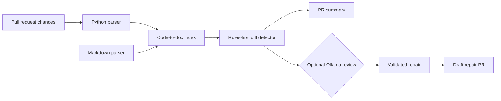

# Self-Healing Technical Documentation


A rules-first GitHub Action that identifies Markdown sections potentially made stale by Python code changes. It runs without an OpenAI API key and is designed to support an optional local Ollama review pass later.

## Use the Action

```yaml
name: Documentation Check

on: pull_request

jobs:
  docs:
    runs-on: ubuntu-latest
    permissions:
      contents: read
      pull-requests: write
    steps:
      - uses: actions/checkout@v4
        with:
          fetch-depth: 0
      - uses: rajaryan-14/self_healing_technical_documentation@v1
        with:
          comment: true
          auto-repair: false
```

## Current MVP

- Extracts Python functions, async functions, and classes with stable IDs.
- Splits Markdown by headings and records heading paths.
- Links docs to code using symbol and identifier references.
- Finds linked documentation sections affected by a Git diff.
- Returns exit code `1` when suspects are found, making it CI-friendly.

The `demo/` directory is a small reproducible fixture: changing the default port in `demo/service.py` without updating `demo/README.md` should produce a documentation finding.

## Architecture



The default path is local and rules-first. Ollama is optional and is used only for deeper review and repair generation.

## Run locally

```powershell
python -m pip install -e ".[dev]"
python -m self_healing_docs.cli index --root .
python -m self_healing_docs.cli check --root . --base HEAD~1
python -m pytest
```


## Demo video

[Download the silent 58-second demo video](docs/self-healing-demo.mp4) and use the matching [SRT caption file](docs/self-healing-demo.srt) when adding narration or captions.

The index is written to `.self-healing/docs-index.json`. Add that directory to `.gitignore` if you prefer to regenerate it in CI.

## Planned next step

The repository now includes a Docker-based GitHub Action in `action.yml` and an example workflow in `.github/workflows/example.yml`. The action has no API-key requirement, writes a Markdown job summary, exposes JSON findings, and supports `fail-on-findings: true` when teams want stale-doc suspects to block merging.

In pull request context, the example workflow also posts a summary comment. It needs `pull-requests: write`; set `comment: false` to disable comments.

Set `auto-repair: true` only on a runner with Ollama available. Validated repairs are committed to a branch and opened as a draft PR; the default is `false`.

## Use as a local action

Copy the repository into a project or reference it from a fork:

```yaml
- uses: your-user/self-healing-docs@main
  with:
    fail-on-findings: false
```

An optional Ollama review adapter is the next enhancement; the rules-only check remains the default.

## Optional local Ollama review

Install [Ollama](https://ollama.com), start a model, and run:

```powershell
ollama pull qwen2.5-coder:7b
python -m self_healing_docs check --root . --base HEAD~1 --ollama --model qwen2.5-coder:7b
```

If Ollama is unavailable, the command still completes and records an unavailable-model explanation instead of requiring a cloud key.

## Generate targeted repairs

Repairs are proposed first and never applied implicitly:

```powershell
python -m self_healing_docs repair --root . --base HEAD~1 --model qwen2.5-coder:7b
python -m self_healing_docs repair --root . --base HEAD~1 --model qwen2.5-coder:7b --apply
```

Proposals are saved in `.self-healing/repair.json`. A second Ollama validation pass checks each proposal, and only repairs with both generation and validation confidence of at least `0.8` are applied.
